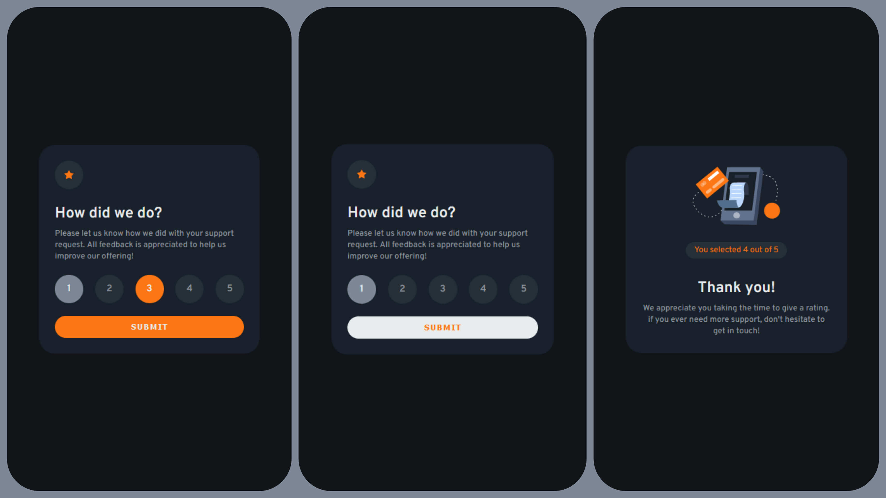

# Frontend Mentor - Interactive rating component solution

This is a solution to the [Interactive rating component challenge on Frontend Mentor](https://www.frontendmentor.io/challenges/interactive-rating-component-koxpeBUmI).

### The challenge

Users should be able to:

- View the optimal layout for the app depending on their device's screen size
- See hover states for all interactive elements on the page
- Select and submit a number rating
- See the "Thank you" card state after submitting a rating

### Screenshot

### Links

- [Solution URL](https://your-solution-url.com)
- [Live Site URL](https://kiran-m-p.github.io/rating-page/)

### What I learned

- Design to built work flow
- React Components and react router
- CSS pseudo states
- ReactRouter vs HashRouter
- Deploying SPA with clientside routing in gh-pages 🤯(most difficult part)
- Thanks to [spa-github-pages](https://github.com/rafgraph/spa-github-pages)
